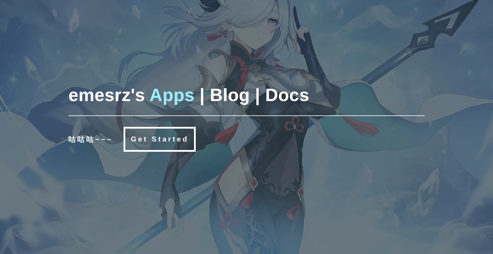

## 功能特性

- ✅ 响应式设计
- ✅ 图像网格布局，支持平滑过渡
- ✅ 定制化主页
- ✅ 集成博客与文档（即将上线）

## 演示

👉 访问在线站点：[app-emesrz.vercel.app](https://emesrz-app.vercel.app/)
## 授权协议

本项目基于 HTML5 UP 的 [Forty 模板](https://html5up.net/forty)，遵循 [CC BY 3.0 许可证](https://html5up.net/license)